# Execution Plan — cryptLlama

## Detailed Analysis Summary

### Change Impact Assessment

| Impact Area | Result | Notes |
|---|---|---|
| User-facing changes | Yes | Entirely new user-facing CLI application |
| Structural changes | Yes | New application, multiple distinct components from scratch |
| Data model changes | Yes | Encrypted file format header (FR-07): magic bytes, version, salt, IV/nonce, GCM auth tag |
| API changes | N/A | CLI only — no API or service interface |
| NFR impact | Yes | Security-critical (AES-256-GCM, key derivation, SecureRandom, memory handling) + streaming I/O performance |

### Risk Assessment

| Dimension | Rating | Rationale |
|---|---|---|
| Risk Level | **Medium** | Multiple interacting components; security-critical implementation; well-understood patterns |
| Rollback Complexity | **Easy** | Greenfield — nothing to roll back to |
| Testing Complexity | **Moderate** | Requires encrypt/decrypt round-trip tests, error path coverage, and security-sensitive test cases |

---

## Workflow Visualization

```mermaid
flowchart TD
    Start(["User Request"])

    subgraph INCEPTION["INCEPTION PHASE"]
        WD["Workspace Detection\nCOMPLETED"]
        RE["Reverse Engineering\nSKIPPED - Greenfield"]
        RA["Requirements Analysis\nCOMPLETED"]
        US["User Stories\nCOMPLETED"]
        WP["Workflow Planning\nCOMPLETED"]
        AD["Application Design\nEXECUTE"]
        UG["Units Generation\nEXECUTE"]
    end

    subgraph CONSTRUCTION["CONSTRUCTION PHASE - per unit"]
        FD["Functional Design\nEXECUTE"]
        NFRA["NFR Requirements\nEXECUTE"]
        NFRD["NFR Design\nEXECUTE"]
        ID["Infrastructure Design\nSKIP - no infrastructure"]
        CG["Code Generation\nEXECUTE"]
        BT["Build and Test\nEXECUTE"]
    end

    Start --> WD
    WD --> RE
    RE --> RA
    RA --> US
    US --> WP
    WP --> AD
    AD --> UG
    UG --> FD
    FD --> NFRA
    NFRA --> NFRD
    NFRD --> ID
    ID --> CG
    CG --> BT
    BT --> End(["Complete"])

    style WD fill:#4CAF50,stroke:#1B5E20,stroke-width:3px,color:#fff
    style RE fill:#BDBDBD,stroke:#424242,stroke-width:2px,stroke-dasharray: 5 5,color:#000
    style RA fill:#4CAF50,stroke:#1B5E20,stroke-width:3px,color:#fff
    style US fill:#4CAF50,stroke:#1B5E20,stroke-width:3px,color:#fff
    style WP fill:#4CAF50,stroke:#1B5E20,stroke-width:3px,color:#fff
    style AD fill:#FFA726,stroke:#E65100,stroke-width:3px,stroke-dasharray: 5 5,color:#000
    style UG fill:#FFA726,stroke:#E65100,stroke-width:3px,stroke-dasharray: 5 5,color:#000
    style FD fill:#FFA726,stroke:#E65100,stroke-width:3px,stroke-dasharray: 5 5,color:#000
    style NFRA fill:#FFA726,stroke:#E65100,stroke-width:3px,stroke-dasharray: 5 5,color:#000
    style NFRD fill:#FFA726,stroke:#E65100,stroke-width:3px,stroke-dasharray: 5 5,color:#000
    style ID fill:#BDBDBD,stroke:#424242,stroke-width:2px,stroke-dasharray: 5 5,color:#000
    style CG fill:#4CAF50,stroke:#1B5E20,stroke-width:3px,color:#fff
    style BT fill:#4CAF50,stroke:#1B5E20,stroke-width:3px,color:#fff
    style Start fill:#CE93D8,stroke:#6A1B9A,stroke-width:3px,color:#000
    style End fill:#CE93D8,stroke:#6A1B9A,stroke-width:3px,color:#000

    linkStyle default stroke:#333,stroke-width:2px
```

---

## Phases to Execute

### INCEPTION PHASE

- [x] Workspace Detection — **COMPLETED**
- [x] Reverse Engineering — **SKIPPED** (Greenfield project — no existing codebase)
- [x] Requirements Analysis — **COMPLETED**
- [x] User Stories — **COMPLETED**
- [x] Workflow Planning — **COMPLETED** (this document)
- [ ] Application Design — **EXECUTE**
  - **Rationale**: New application with multiple distinct components (CLI, encryption engine, key management, file I/O). Component interfaces, responsibilities, and dependencies must be defined before coding.
- [ ] Units Generation — **EXECUTE**
  - **Rationale**: Application decomposes into at least three separable units. Explicit unit decomposition ensures each is designed and coded coherently with full traceability.

### CONSTRUCTION PHASE (executed per unit)

- [ ] Functional Design — **EXECUTE**
  - **Rationale**: New file format data model (FR-07 header structure) and multi-scenario business logic (auto-detect encrypt/decrypt, password vs auto-key paths) require detailed functional design.
- [ ] NFR Requirements — **EXECUTE**
  - **Rationale**: Explicit security NFRs (NFR-01 through NFR-04) require tech stack decisions (JDK version, PBKDF2 vs Argon2 library). Performance NFR (NFR-07 streaming I/O) needs specification.
- [ ] NFR Design — **EXECUTE**
  - **Rationale**: NFR Requirements will execute; patterns for secure memory handling, streaming cipher, and key derivation configuration must be designed before code generation.
- [ ] Infrastructure Design — **SKIP**
  - **Rationale**: cryptLlama is a local CLI tool with no cloud infrastructure, servers, or networking. JAR/executable packaging is handled within Build and Test.
- [ ] Code Generation — **EXECUTE** (always)
  - **Rationale**: Implementation phase — generate all Java source, tests, and build configuration.
- [ ] Build and Test — **EXECUTE** (always)
  - **Rationale**: Compile, run tests, and produce the distributable artifact.

### OPERATIONS PHASE

- [ ] Operations — **PLACEHOLDER**
  - **Rationale**: Future expansion — no deployment or monitoring workflows defined for Phase 1 CLI tool.

---

## Success Criteria

- **Primary Goal**: A working `cryptLlama` CLI that encrypts and decrypts files using AES-256-GCM, accessible to all skill levels
- **Key Deliverables**: Java source code, unit and integration tests, distributable JAR, build instructions
- **Quality Gates**:
  - All user story acceptance criteria pass
  - All security NFRs implemented and verified
  - Encrypt → decrypt round-trip produces byte-identical original file
  - Wrong-password and tampered-file scenarios handled gracefully
  - Exit codes correct for success and all failure scenarios
